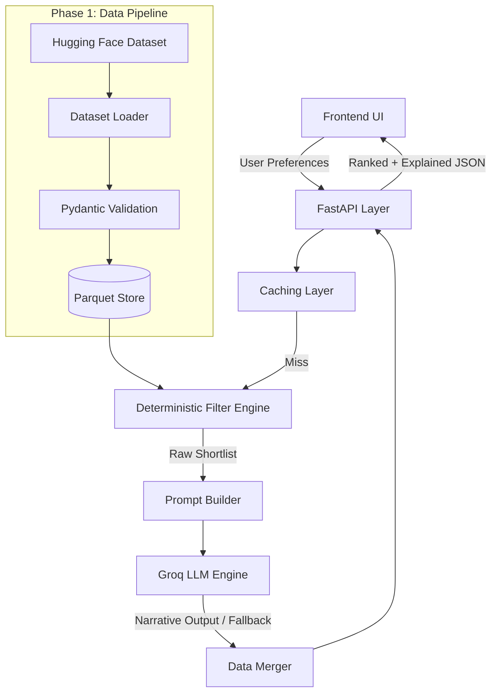

# Architecture Design: Restaurant Recommender System

This document outlines the detailed architecture and implementation strategy for a highly scalable, production-ready Restaurant Recommender System. The architecture strictly follows a 5-phase execution model to guarantee robust separation of concerns, high maintainability, and seamless scalability.

---

## Architecture Overview

---

## Phase 1: Foundation, Dataset Contract, and Catalog

**Objective:** Securely ingest, normalize, clean, and store the restaurant dataset ensuring a strict data contract before any application logic accesses the data.

**Key Components:**
- `src/phase1_data/dataset_loader.py`: The ETL script executing the downloading, cleaning, and storage operations.
- `src/phase1_data/data_schema.py`: Pydantic models acting as the data contract.

**Deep Dive:**
1. **Ingestion Layer:** The pipeline connects to the Hugging Face `datasets` API to download the raw dataset `ManikaSaini/zomato-restaurant-recommendation`. If Hugging Face is unreachable, it gracefully falls back to local raw `.parquet` backups.
2. **Transformations & Normalizations:**
   - **Cuisine Parsing:** Raw comma-separated string is transformed into normalized lower-case lists.
   - **Cost Normalization:** Dirty numeric fields are rigorously sanitized, stripped of commas, and cast to pure `float` values representing cost for two.
   - **Ratings & Votes Extraction:** Ratings formatted as "4.1/5" are regex-matched/split to retain strictly the floating-point score.
3. **Missing Value Handling:** Missing, `NEW`, or `-` ratings are handled explicitly and default to `0.0`. Missing or un-castable costs are defaulted to `0.0`.
4. **Data Validation:** Data is passed through a Pydantic `BaseModel`. Any row failing validation is dropped, and the drop is logged systematically.
5. **Storage Format:** Final sanitized catalog is serialized to Parquet format (`data/processed/catalog.parquet`) for its columnar compression and fast-read I/O.

**Exit Criteria:** A validated, type-safe Parquet file exists, representing the golden standard of restaurant data.

---

## Phase 2: User Preference Modeling and Deterministic Filtering

**Objective:** Implement a robust deterministic filtering pipeline to prune the dataset down to a highly relevant, manageable shortlist based on explicit user constraints.

**Key Components:**
- `src/phase2_filtering/models.py`: Types for user requests and internal representations.
- `src/phase2_filtering/filter_engine.py`: The execution engine handling complex Pandas operations.

**Deep Dive:**
1. **Typed Context Initialization:** Client requests are parsed into `UserPreferences` representing `location`, `cuisine` (optional), `min_rating`, `max_budget`, and `extra_preferences` (optional).
2. **Sequential DataFrame Filtering:**
   - **Location:** Exact case-insensitive matching. High selectivity.
   - **Cuisine:** Explodes list-based cuisines and filters if the target cuisine exists within the restaurant's offerings. (Skipped if not provided).
   - **Rating:** Mathematical `rating >= min_rating`. 
   - **Budget:** Mathematical `cost_for_two <= max_budget`.
3. **Filter Relaxation Logic:** If the strict rating filter results in too few results (less than `max_shortlist_size`), the engine will relax the `min_rating` by 0.5 (once) and re-evaluate to ensure adequate recommendations.
4. **Ranking & Limiting:** Surviving records are sorted primarily by `rating` (descending) and secondarily by popularity `votes` (descending). The engine slices the top `N` results dynamically fetched from `config.yaml` (`max_shortlist_size`).
5. **Resiliency & Soft Degradation:** Instead of failing silently, the engine identifies exactly which filter depleted the dataset returning structured enumerations (e.g., `NO_MATCH_RATING`).

**Exit Criteria:** A deterministic subset of ranked and optimized items along with an exact execution status code.

---

## Phase 3: LLM Integration and Orchestration

**Objective:** Inject personalized, contextual explanations into the shortlist using the Groq LLM without suffering from factual hallucinations. The API key for Groq (`GROQ_API_KEY`) will be securely loaded from the `.env` file.

**Key Components:**
- `src/phase3_llm/prompt_builder.py`: Generates the exact token stream supplied to the LLM.
- `src/phase3_llm/groq_client.py`: Client executing API requests handling network instability and enforcement.

**Deep Dive:**
1. **Prompt Isolation Strategies:** Only lightweight summarized parameters (name, cuisines, rating, cost) are included in the prompt. `extra_preferences` are dynamically injected into the prompt if the user provides them, steering the LLM to hunt for those specific nuances.
2. **Strict Generation Boundaries:** The prompt explicitly enforces that the LLM *must only use provided shortlist data* to build explanations, severely restricting external hallucinations.
3. **Structured JSON Generation:** Enforces `response_format={"type": "json_object"}` natively ensuring the output is perfectly parsable.
4. **Fallbacks and Retry Loops:** Built-in exponential backoff. If the LLM API fails completely after all retries, a fallback mechanism takes over: the system bypasses the LLM entirely and uses the deterministic ranking logic from Phase 2, populating default narrative explanations.
5. **Anti-Hallucination Merging:** The LLM output contains *only* the reasoning. The orchestration script maps this back to the exact tabular row obtained in Phase 2. The LLM never touches or rewrites numeric values.

**Exit Criteria:** A fully merged JSON payload retaining the strict data properties of Phase 2 paired with the hyper-personalized text outputs, or a deterministic fallback if the AI fails.

---

## Phase 4: API Layer and Frontend

**Objective:** Provide an interfacing surface for consumers programmatically via a robust REST API. *(Note: The visual Web App frontend will be implemented later on).*

**Key Components:**
- `src/phase4_api/main.py`: FastAPI implementation serving logic.
- `src/phase4_api/schemas.py`: REST JSON contracts.
- `web/`: Contains static UI artifacts.

**Deep Dive:**
1. **FastAPI Endpoints:** Exposes `POST /recommend` and `GET /locations` (for populating dynamic dropdowns). Leveraging dependency injection and strict typing.
2. **Zero-Match Scenarios:** In cases where filtering results in no matches, the API strictly returns an HTTP 200 OK status containing an empty items list `[]` and a clear, user-facing summary message detailing the reason (e.g., "No restaurants found matching your budget constraints").
3. **Response Metadata:** Every response object explicitly includes metadata fields: `shortlist_size`, `model` (e.g., Llama-3-8B), and `prompt_version`.
4. **Asynchronous Non-Blocking Execution:** Uvicorn executes the app enabling high concurrency.
5. **Frontend Architecture:** The visual Web App frontend using Vanilla CSS and JS will be implemented in a subsequent phase once the API logic is fully validated.

**Exit Criteria:** Users can programmatically submit their data and receive robust, HTTP-compliant structured responses. The system is ready for frontend integration.

---

## Phase 5: Hardening, Observability, and Quality

**Objective:** Ensure the system scales safely and can be audited and maintained in production.

**Key Components:**
- `src/phase5_infra/cache.py`: Cache management system.
- `src/phase5_infra/logger.py`: JSON structured logger.
- `config.yaml` / `.env`: The config paradigm.

**Deep Dive:**
1. **In-Memory Query Hashing:** Intercepts incoming requests and caches responses to avoid redundant LLM executions.
2. **Structured Metrics Tracking:** The structured JSON logger actively records highly specific metrics per request, including:
   - `duration_filter_ms`: Time taken for the Pandas deterministic filtering.
   - `duration_llm_ms`: Time taken for the Groq LLM network call and parsing.
   - `shortlist_size`: Total items evaluated.
   - `outcome`: Categorical result (success / empty / error).
3. **Configuration Driven System:** Absolutely all thresholds (rating relaxation constraints), configurations (dataset source, max tokens), and logic flags are strictly controlled via `config.yaml`.
4. **Environment Security:** API keys are isolated in `.env`.

**Exit Criteria:** The system is entirely instrumented, caches efficiently, exposes explicit metrics pipelines, and is entirely dictated by decoupled external configuration files.

---

## Deployment

**Objective:** Deploy the application stack for production access.

**Strategy:**
- **Backend Deployment (Streamlit):** The backend services and logic will be deployed via Streamlit.
- **Frontend Deployment (Vercel):** The web application user interface will be deployed on Vercel for highly optimized static delivery and global availability.

