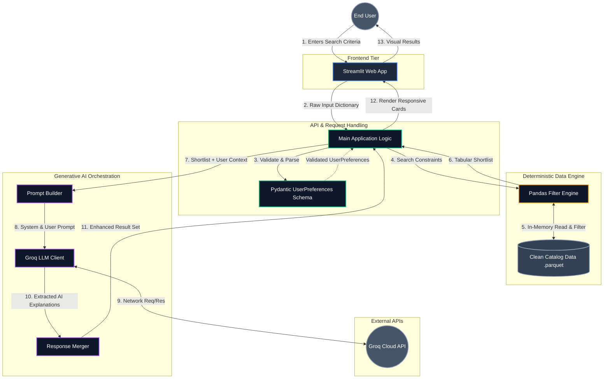

# System Architecture & Data Flow

This diagram strictly details the technical components and the flow of data through the system, from the client interface down to the deterministic processing and generative AI layers.

