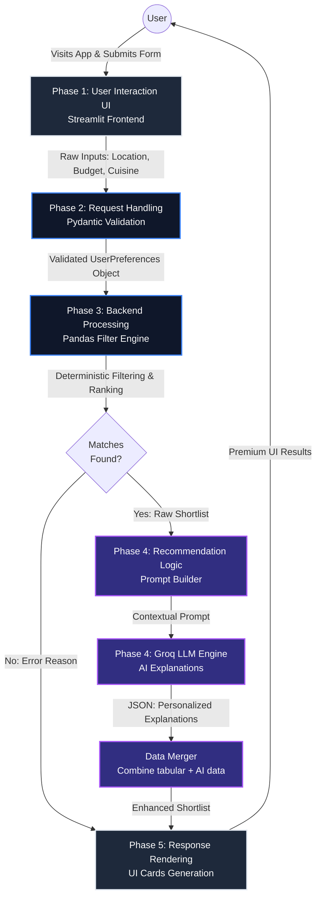

# Zomato AI Recommender: System Architecture & Workflow

This document provides a comprehensive overview of the system architecture, end-to-end data flow, phase-wise working, and the technology stack powering the Zomato AI Restaurant Recommender.

---

## 1. Architecture Diagram

The following diagram illustrates how data flows seamlessly between the user interface, the backend processing engine, and the AI orchestration layer.

---

## 2. End-to-End Flow

When a user interacts with the platform, the following sequence of events takes place:

1. **Opening the Website:** The user opens the Streamlit web application. They are greeted with a premium, glassmorphic UI. 
2. **Capturing Input:** The user fills out the search form, selecting a location (mandatory) and optional parameters like cuisine, minimum rating, maximum budget, and "Extra Preferences" (e.g., "quiet place for a date", "good for kids").
3. **Request to Backend:** Upon clicking "Find Places", the raw UI inputs are instantly captured and passed to the backend. The inputs are rigorously validated using Pydantic to ensure data integrity.
4. **Deterministic Filtering:** The system loads the highly optimized Parquet dataset. Using Pandas, it rapidly filters out restaurants that don't match the strict criteria (e.g., dropping anything over budget or in the wrong location). It sorts the remaining restaurants by rating and popularity, slicing the top results into a "Shortlist".
5. **Recommendation Logic:** The tabular shortlist is sent to the `PromptBuilder`. This component constructs a highly specific set of instructions for the LLM, injecting the user's "Extra Preferences" so the AI knows exactly what context to focus on.
6. **AI Processing:** The prompt is sent to the Groq API. The LLM acts purely as a reasoning engine—it doesn't invent new restaurants. Instead, it reads the provided shortlist and generates a personalized, human-like explanation for *why* each place is a great fit, returning it in strict JSON format.
7. **Response Rendering:** The system merges the AI's generated text with the original, factual numeric data (ratings, exact cost, location). Finally, the Streamlit frontend dynamically renders these merged results as beautiful, responsive cards for the user to explore.

---

## 3. Phase-wise Working (Interview Ready)

> [!NOTE]
> This section breaks down the system's execution into 5 logical phases, using simple language ideal for technical interviews or stakeholder presentations.

### Phase 1: User Interaction (UI)
**"The Presentation Layer"**
- **What happens:** The user visits the application and interacts with a modern, dark-themed interface built with Streamlit.
- **Why it matters:** This phase is all about user experience (UX). We capture user intent (location, budget, mood) through intuitive dropdowns and sliders, ensuring the application feels responsive and premium right from the start.

### Phase 2: Request Handling
**"The Gatekeeper"**
- **What happens:** The raw input from the UI is captured and immediately passed through a strict validation layer using Pydantic. It transforms raw strings and numbers into a secure, typed `UserPreferences` object.
- **Why it matters:** It prevents invalid data, missing locations, or malicious inputs from crashing the backend. It establishes a strict "contract" between the frontend and the backend.

### Phase 3: Backend Processing
**"The Heavy Lifter"**
- **What happens:** This is the core data engine. We use Pandas to load our pre-cleaned Zomato dataset (stored efficiently as Parquet files) and perform highly optimized, in-memory filtering. We strictly enforce the budget, location, and rating constraints, funneling thousands of rows down to a highly relevant Top-5 shortlist.
- **Why it matters:** LLMs are expensive and slow. By deterministically filtering the data *first*, we ensure the AI only processes the absolute best matches. This guarantees speed, reduces costs, and strictly prevents AI hallucinations (e.g., recommending a $100 restaurant when the budget was $20).

### Phase 4: Recommendation Logic
**"The Brain"**
- **What happens:** The curated shortlist is passed to an AI orchestrator. We build a specialized prompt that includes the shortlist and the user's specific mood or extra preferences. The Groq LLM analyzes this and generates a tailored, hyper-personalized narrative for each restaurant. 
- **Why it matters:** This bridges the gap between raw tabular data and human context. Instead of just seeing "Rating: 4.5", the user reads: *"Perfect for your date night, featuring the quiet outdoor seating you requested."* We force the LLM to output pure JSON to guarantee easy parsing.

### Phase 5: Response Rendering
**"The Delivery"**
- **What happens:** The AI-generated explanations are merged back with the factual numeric data. The complete, enhanced dataset is sent back to the frontend, where Streamlit dynamically generates visually appealing result cards containing ratings, prices, and the AI's insights.
- **Why it matters:** It completes the loop by delivering a "wow" factor to the user, presenting complex AI reasoning in an easily digestible, visually stunning format.

---

## 4. Tech Stack Explanation

> [!TIP]
> The technology choices were made to optimize for developer velocity, inference speed, and system reliability.

* **Frontend / UI:** **Streamlit** (with custom injected CSS)
  * *Why:* Allows for rapid prototyping of data applications purely in Python while still supporting advanced CSS for premium aesthetics (like glassmorphism and modern typography).
* **Backend Validation:** **Pydantic**
  * *Why:* Provides strict, production-ready type checking. It guarantees the shape of our data entering the system, catching edge cases immediately.
* **Data Processing Engine:** **Pandas** & **PyArrow**
  * *Why:* Pandas offers unparalleled, vectorized execution for filtering tabular data. PyArrow allows us to store the catalog in `.parquet` format, which is vastly superior to `.csv` in terms of read-speed and file compression.
* **AI Orchestration / LLM:** **Groq API** 
  * *Why:* Groq utilizes LPU (Language Processing Unit) architecture, offering insanely fast inference speeds compared to traditional GPU clusters. This ensures the recommendation generation feels instant to the end-user.
* **Language:** **Python 3.10+**
  * *Why:* The industry standard for AI and Data Engineering pipelines, offering the richest ecosystem for integrating Pandas, Pydantic, and LLM clients seamlessly.
